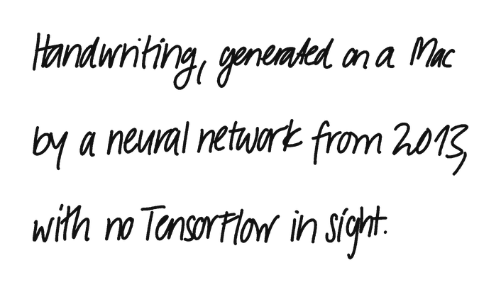
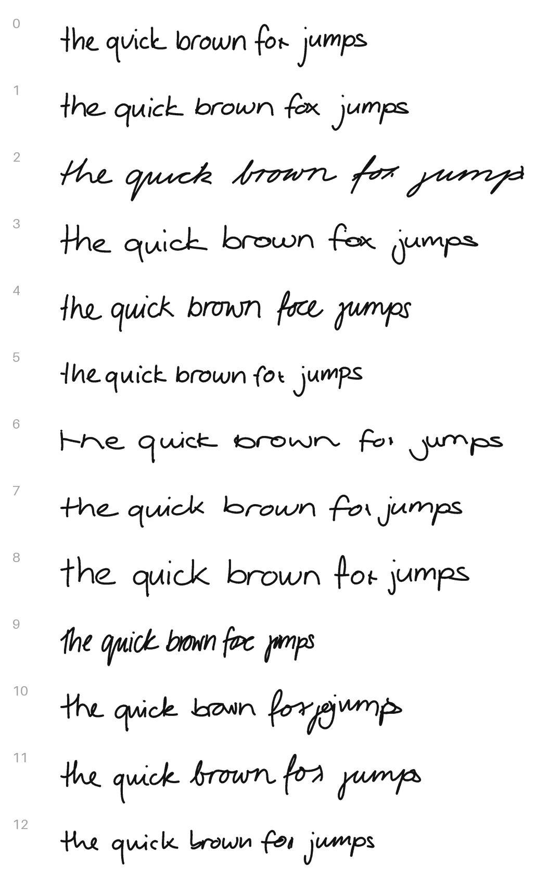

# Handwriting

A macOS app that writes what you type in a human hand, and saves it as PNG or SVG.
No terminal, no Python install, no TensorFlow.



This is a fork of [sjvasquez/handwriting-synthesis](https://github.com/sjvasquez/handwriting-synthesis),
an implementation of the handwriting synthesis experiments in
[Generating Sequences with Recurrent Neural Networks](https://arxiv.org/abs/1308.0850)
by Alex Graves. The model and its pretrained weights are unchanged - what is new
is everything around them: the network now runs on numpy, so it fits in a
double-clickable app.

## Download

1. Get `Handwriting-macOS-arm64.zip` from [Releases](../../releases).
2. Unzip and drag **Handwriting.app** into Applications.
3. First launch only: the app is signed but not notarized by Apple, so macOS asks.
   Right-click the app and choose **Open**, or go to
   **System Settings → Privacy & Security** and press **Open Anyway**.

Apple Silicon (M1 and later). No installation, no dependencies, works offline.

## Using it

- **Type** anything. Lines longer than 75 characters wrap on word boundaries,
  blank lines become blank lines.
- **Style** picks one of 13 real handwriting samples that prime the network.
  The strip under the controls shows the actual sample.
- **Neatness** steadies the hand. It is the network's sampling bias: at 0.3 the
  writing wanders and scrawls, at 2.0 it writes carefully. The default, 1.0, is
  legible but still looks handwritten.
- **Pen** sets stroke width, and the swatch next to it sets the colour.
- **Save PNG** or **Save SVG**. Both are saved with a transparent background, so
  handwriting drops straight onto a document, and the SVG scales forever and
  opens in Illustrator or Figma.

The preview goes through the same renderer that writes the file, so what is on
screen is what gets saved.

The network only knows 73 characters. Accents are stripped (`è` becomes `e`),
a few symbols are substituted (`&` becomes `and`), uppercase `Q X Z` were never
in the training set and become lowercase. Anything left over is listed under the
text box instead of being silently dropped.



## How it runs without TensorFlow

The original needs TensorFlow 1.6, which has no Apple Silicon build - bundling it
into an app is not an option. So the model was moved off it entirely:

- **`tools/tf_export.py`** loads the frozen meta graph with TF2's `compat.v1` API
  (no `tf.contrib`, no Python 2, no Rosetta) and dumps the ten weight tensors the
  model actually uses into `hw/weights.npz` - 14 MB, down from a 43 MB checkpoint
  that was mostly optimizer state.
- **`hw/engine.py`** re-implements inference in numpy: three 400-unit LSTMs, the
  Gaussian attention window over the character sequence, and the 20-component
  mixture density output that gets sampled into pen movements.
- **`hw/drawing.py`** drops scipy: the Savitzky-Golay smoother the original
  imports is a fixed 7-tap kernel, so it is one convolution.
- **`hw/render.py`** rounds the corners of the pen path with quadratic Beziers -
  the network emits points about a unit apart, which show as facets when
  enlarged - and stamps the pen as overlapping dots instead of drawing a thick
  polyline, because PIL's wide lines leave serrated edges at every vertex of a
  hand-drawn path. The PNG comes out indistinguishable from the SVG.

**`tests/test_engine.py`** is what makes this trustworthy. It replays a
deterministic trace captured from the original graph: after 738 recurrent steps
the mixture density parameters agree to `7.6e-05` (on values up to 25), and every
state tensor to `1e-05`. The sampling path was checked separately by running both
implementations at a bias high enough to make sampling near-deterministic - same
trajectory, identical pen-up flags on all 203 steps.

The result is a 63 MB app that draws a line of text in about a second on CPU.

## Building it yourself

```bash
uv venv --python 3.12 .venv
VIRTUAL_ENV=.venv uv pip install numpy pillow pyinstaller
./tools/build_app.sh          # -> dist/Handwriting.app
```

Run it from source with `.venv/bin/python app.py`, and the tests with
`.venv/bin/python tests/test_engine.py`.

`hw/weights.npz` is committed, so none of this needs TensorFlow. Regenerating it
from `checkpoints/` does - `uv pip install "tensorflow>=2.16"`, then
`python tools/tf_export.py`. `tools/make_icon.py` draws the app icon by asking
the model to write "Aa", and `tools/make_samples.py` builds the images above.

## The original project

The training pipeline is untouched and still needs TensorFlow 1.x:
`prepare_data.py` for the IAM-OnDB data, `rnn.py` to train, `demo.py` for the
scripted examples. See the
[upstream README](https://github.com/sjvasquez/handwriting-synthesis/blob/master/readme.md)
and its [web demo](https://seanvasquez.com/handwriting-generation/).
All credit for the model, the training and the pretrained weights goes to
[Sean Vasquez](https://github.com/sjvasquez).
